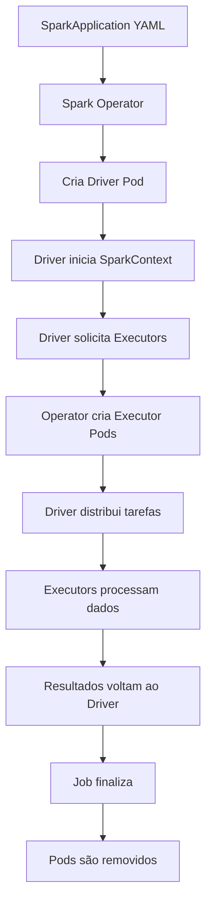

# 🚀 Astronauts Spark Launcher

Projeto que demonstra como executar jobs Spark via API FastAPI usando Kubernetes e Spark Operator.

## 📁 Estrutura do Projeto

```
├── launcher/                    # API FastAPI para lançar jobs Spark
│   ├── api/                     # Código da API
│   ├── k8s/                     # Manifests K8s da API
│   ├── manifests/               # Templates dos jobs Spark
│   ├── Dockerfile               # Dockerfile da API
│   └── requirements.txt         # Dependências Python da API
├── jobs/                        # Jobs Spark
│   ├── astronauts.py           # Script que busca astronautas no espaço
│   ├── Dockerfile              # Dockerfile para jobs Spark
│   └── spark-requirements.txt  # Dependências Python dos jobs
└── README.md                   # Este arquivo
```

## 🎯 Conceitos Fundamentais

### SparkApplication vs Driver vs Executor

#### 🧠 **SparkApplication**
É um **recurso customizado do Kubernetes** (CRD) criado pelo Spark Operator que representa um job Spark completo.

- **Função**: Gerencia todo o ciclo de vida de um job Spark
- **Analogia**: É como uma "receita" que diz ao Kubernetes como executar seu job Spark
- **Responsabilidades**:
  - Criar pods para Driver e Executors
  - Gerenciar configurações de recursos
  - Monitorar status da execução
  - Fazer cleanup após conclusão

#### 🚗 **Driver** 
É o **cérebro** do job Spark - coordena toda a execução.

- **Função**: Coordenador principal que gerencia a execução
- **Onde roda**: Em um pod separado no Kubernetes (`spark-astronauts-XXXXXX-driver`)
- **Responsabilidades**:
  - Criar o `SparkContext`
  - Dividir o trabalho em tarefas
  - Distribuir tarefas para os Executors
  - Coletar resultados
  - Exibir logs principais

#### ⚡ **Executor**
São os **trabalhadores** que executam as tarefas distribuídas.

- **Função**: Processam os dados em paralelo
- **Onde roda**: Em pods separados (`spark-astronauts-XXXXXX-exec-X`)
- **Responsabilidades**:
  - Executar tarefas recebidas do Driver
  - Armazenar dados em cache se necessário
  - Enviar resultados de volta ao Driver

### 📊 Fluxo de Execução



## 📋 Documentação do SparkApplication YAML

### Estrutura Básica

```yaml
apiVersion: sparkoperator.k8s.io/v1beta2  # Versão da API do Spark Operator
kind: SparkApplication                     # Tipo de recurso Kubernetes
metadata:
  name: spark-astronauts                   # Nome único do job (será substituído por timestamp)
  namespace: default                       # Namespace onde o job será executado
spec:
  # Configurações do job aqui...
```

### Configurações do Job

```yaml
spec:
  type: Python                    # Tipo de aplicação Spark
                                 # Opções: Java, Scala, Python, R
  
  pythonVersion: "3"             # Versão do Python (apenas para type: Python)
                                 # Opções: "2", "3"
  
  mode: cluster                  # Modo de execução
                                 # cluster: Driver roda no cluster K8s
                                 # client: Driver roda fora do cluster (não recomendado)
  
  image: docker.io/gmaas2/spark-astronauts-jobs:1.0  # Imagem Docker com Spark + código
  
  imagePullPolicy: Always        # Política de pull da imagem
                                 # Always: Sempre faz pull
                                 # IfNotPresent: Pull apenas se não existir localmente
                                 # Never: Nunca faz pull
  
  mainApplicationFile: local:///opt/spark/jobs/astronauts.py  # Arquivo principal
                                 # local:// = arquivo dentro da imagem
                                 # s3://, gs://, hdfs:// = arquivos remotos
  
  sparkVersion: 3.5.3           # Versão do Spark (deve corresponder à imagem)
```

### Políticas de Restart

```yaml
  restartPolicy:
    type: Never                  # Política de restart em caso de falha
                                 # Never: Nunca reinicia automaticamente
                                 # OnFailure: Reinicia apenas em caso de falha
                                 # Always: Sempre reinicia
    
    # Para OnFailure, você pode configurar:
    # onFailureRetries: 3               # Número máximo de tentativas
    # onFailureRetryInterval: 10        # Intervalo entre tentativas (segundos)
    # onSubmissionFailureRetries: 5     # Tentativas para falhas de submissão
```

### Configurações do Driver

```yaml
  driver:
    cores: 1                     # Número de CPUs para o driver
                                 # Recomendado: 1-2 cores (driver não processa dados)
    
    memory: 512m                 # Memória para o driver
                                 # Formato: 512m, 1g, 2048m
                                 # Inclui overhead do JVM (~10%)
    
    serviceAccount: spark-operator-spark  # ServiceAccount com permissões K8s
                                         # Necessário para criar/gerenciar executors
    
    # Configurações opcionais:
    # labels:                    # Labels adicionais para o pod do driver
    #   app: my-spark-app
    # annotations:               # Annotations para o pod
    #   monitoring: enabled
    # tolerations: []            # Tolerations para scheduling
    # nodeSelector: {}           # Seleção de nós específicos
    # env:                       # Variáveis de ambiente
    #   - name: MY_VAR
    #     value: "my-value"
```

### Configurações dos Executors

```yaml
  executor:
    cores: 1                     # CPUs por executor
                                 # Recomendado: 2-5 cores por executor
    
    instances: 1                 # Número de executors
                                 # Depende do tamanho dos dados e recursos disponíveis
    
    memory: 512m                 # Memória por executor
                                 # Deve ser suficiente para processamento + cache
    
    # Configurações opcionais:
    # labels: {}                 # Labels para pods dos executors
    # annotations: {}            # Annotations
    # tolerations: []            # Tolerations
    # nodeSelector: {}           # Seleção de nós
    # env: []                    # Variáveis de ambiente
```

### Configurações Avançadas (Opcionais)

```yaml
  # Argumentos para a aplicação
  arguments:
    - "--input-path"
    - "s3://my-bucket/data"
    - "--output-path" 
    - "s3://my-bucket/results"
  
  # Configurações específicas do Spark
  sparkConf:
    "spark.sql.adaptive.enabled": "true"
    "spark.sql.adaptive.coalescePartitions.enabled": "true"
    "spark.serializer": "org.apache.spark.serializer.KryoSerializer"
  
  # JARs de dependências adicionais
  deps:
    jars:
      - "s3://my-bucket/jars/my-dependency.jar"
    files:
      - "s3://my-bucket/configs/app.conf"
  
  # Configurações de volume
  volumes:
    - name: shared-storage
      persistentVolumeClaim:
        claimName: my-pvc
  
  # Monitoramento
  monitoring:
    enabled: true
    prometheus:
      jmxExporterJar: "/opt/spark/jars/jmx_prometheus_javaagent.jar"
```

### 📏 Dimensionamento - Regras Práticas

#### Para Jobs Pequenos (< 1GB dados)
```yaml
driver:
  cores: 1
  memory: 512m
executor:
  cores: 1
  instances: 1-2
  memory: 512m
```

#### Para Jobs Médios (1-10GB dados)
```yaml
driver:
  cores: 1
  memory: 1g
executor:
  cores: 2-3
  instances: 2-5
  memory: 2g
```

#### Para Jobs Grandes (> 10GB dados)
```yaml
driver:
  cores: 2
  memory: 2g
executor:
  cores: 3-5
  instances: 5-20
  memory: 4g-8g
```

### 🔍 Estados do SparkApplication

```bash
# Ver status do job
kubectl get sparkapplication

# Estados possíveis:
# SUBMITTED    - Job foi submetido
# RUNNING      - Job está executando  
# COMPLETED    - Job finalizou com sucesso
# FAILED       - Job falhou
# INVALIDATING - Job sendo cancelado
# UNKNOWN      - Estado desconhecido
```

## 🛠️ Pré-requisitos

- Docker
- kubectl
- Kind (Kubernetes in Docker)

## 📦 Setup do Ambiente

### 1. Instalar Kind com Docker

```bash
# Linux
curl -Lo ./kind https://kind.sigs.k8s.io/dl/v0.20.0/kind-linux-amd64
chmod +x ./kind
sudo mv ./kind /usr/local/bin/kind

# Ou via package manager
sudo apt-get update && sudo apt-get install -y kind  # Ubuntu/Debian
brew install kind  # macOS
```

### 2. Criar Cluster Kind

```bash
# Criar cluster
kind create cluster --name spark-cluster

# Verificar se está funcionando
kubectl cluster-info --context kind-spark-cluster
```

### 3. Instalar Spark Operator

```bash
# Adicionar repositório Helm
helm repo add spark-operator https://googlecloudplatform.github.io/spark-on-k8s-operator

# Atualizar repositórios
helm repo update

# Instalar Spark Operator
helm install spark-operator spark-operator/spark-operator \
  --namespace spark-operator \
  --create-namespace \
  --set webhook.enable=true

# Verificar instalação
kubectl get pods -n spark-operator
```

### 4. Criar ServiceAccount para Spark

```bash
kubectl create serviceaccount spark-operator-spark
kubectl create clusterrolebinding spark-operator-spark \
  --clusterrole=edit \
  --serviceaccount=default:spark-operator-spark
```

## 🏗️ Build e Deploy

### 1. Construir Imagens Docker

```bash
# Imagem da API Launcher
cd launcher
docker build -t gmaas2/spark-launcher:latest .
cd ..

# Imagem dos Jobs Spark
cd jobs
docker build -t gmaas2/spark-astronauts-jobs:latest .
cd ..
```

### 2. Carregar Imagens no Kind

```bash
# Carregar imagens no cluster Kind
kind load docker-image gmaas2/spark-launcher:latest --name spark-cluster
kind load docker-image gmaas2/spark-astronauts-jobs:latest --name spark-cluster
```

### 3. Deploy da API

```bash
# Aplicar manifests da API
kubectl apply -f launcher/k8s/fastapi-spark-launcher.yaml

# Verificar se está rodando
kubectl get pods -l app=fastapi-spark-launcher
```

### 4. Expor API Localmente

```bash
# Port-forward para acessar a API
kubectl port-forward svc/fastapi-spark-launcher 8000:80
```

## 🧪 Testando

### 1. Testar API

```bash
# Health check
curl http://localhost:8000/health

# Executar job Spark
curl -X POST http://localhost:8000/launch
```

### 2. Verificar Execução do Spark

```bash
# Listar SparkApplications
kubectl get sparkapplication

# Verificar status detalhado
kubectl describe sparkapplication spark-astronauts-YYYYMMDD-HHMMSS

# Ver logs do driver
kubectl logs spark-astronauts-YYYYMMDD-HHMMSS-driver
```

### 3. Monitorar Pods

```bash
# Ver todos os pods
kubectl get pods

# Acompanhar logs em tempo real
kubectl logs -f spark-astronauts-YYYYMMDD-HHMMSS-driver
```

## 📋 Comandos Úteis

### Debugging

```bash
# Ver eventos do cluster
kubectl get events --sort-by=.metadata.creationTimestamp

# Descrever pod com problemas
kubectl describe pod <pod-name>

# Ver logs de containers específicos
kubectl logs <pod-name> -c <container-name>
```

### Limpeza

```bash
# Deletar SparkApplications antigas
kubectl delete sparkapplication --all

# Deletar API
kubectl delete -f launcher/k8s/fastapi-spark-launcher.yaml

# Deletar cluster Kind
kind delete cluster --name spark-cluster
```

## 🔧 Desenvolvimento

### Modificando a API

1. Edite os arquivos em `launcher/api/`
2. Reconstrua a imagem: `docker build -t gmaas2/spark-launcher:latest launcher/`
3. Carregue no Kind: `kind load docker-image gmaas2/spark-launcher:latest --name spark-cluster`
4. Reinicie o deployment: `kubectl rollout restart deployment fastapi-spark-launcher`

### Modificando Jobs Spark

1. Edite os arquivos em `jobs/`
2. Reconstrua a imagem: `docker build -t gmaas2/spark-astronauts-jobs:latest jobs/`
3. Carregue no Kind: `kind load docker-image gmaas2/spark-astronauts-jobs:latest --name spark-cluster`
4. Execute um novo job: `curl -X POST http://localhost:8000/launch`

## 📊 Exemplo de Saída

Quando executar o job, você verá algo como:

```bash
$ kubectl logs spark-astronauts-20250803-180000-driver

👨‍🚀 Astronautas no espaço agora:
- Oleg Kononenko (ISS)
- Nikolai Chub (ISS)
- Tracy Caldwell Dyson (ISS)
- Matthew Dominick (ISS)
- Michael Barratt (ISS)
- Jeanette Epps (ISS)
- Alexander Grebenkin (ISS)
- Butch Wilmore (ISS)
- Sunita Williams (ISS)
- Li Guangsu (Tiangong)
- Li Cong (Tiangong)
- Ye Guangfu (Tiangong)
```

## 🚨 Troubleshooting

### Erro "ImagePullBackOff"
- Verifique se as imagens foram carregadas no Kind: `docker exec -it spark-cluster-control-plane crictl images`

### Erro "CrashLoopBackOff"
- Verifique os logs: `kubectl logs <pod-name>`
- Verifique as dependências no `requirements.txt`

### API não responde
- Verifique se o port-forward está ativo
- Verifique se o pod da API está rodando: `kubectl get pods -l app=fastapi-spark-launcher`

## 🎯 Próximos Passos

- [ ] Adicionar persistência com PostgreSQL
- [ ] Implementar scheduling com CronJobs
- [ ] Adicionar monitoramento com Prometheus
- [ ] Configurar logs centralizados
- [ ] Implementar testes automatizados 